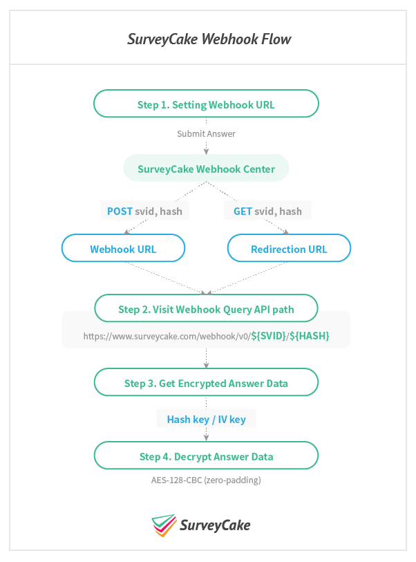
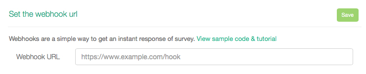
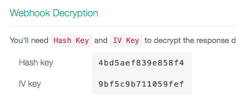

# SurveyCake Webhook

[繁中](./README.md) | [English](./README-en.md)

- [Introduction](#introduction)
- [Process](#process)
- [Testing Tools](#testing-tools)
- [Q & A](#q--a)

## Introduction

With SurveyCake Webhook, it is possible to build your own API for behavior trigger based on survey response. This is an introduction on SurveyCake Webhook concatenation and answer decryption.

## Process

- [**Step 1. URL setup**](#step-1-url-setup)
- [**Step 2. API Visit**](#step-2-api-visit)
- [**Step 3. Answer inquiry**](#step-3-answer-inquiry)
- [**Step 4. Answer decryption**](#step-4-answer-decryption)
- [**Step 5. Use of Information**](#step-5-use-of-information)

---

### Step 1. URL setup

SurveyCake offers two types of URL settings that facilitate behavior trigger based on survey response: `Notification > Webhook` and `Custom Thank You`：

- `Notification > Webhook`
	- After survey answer is entered, SurveyCake will use **POST** request to access specified Webhook URL.
	- Applicable to backend API.
- `Custom Thank You`
	- After survey answer is entered, SurveyCake will use **GET** request to import necessary variables and redirect to your designated thank you page.
	- Applicable to frontend script

The following introduction is based on `Webhook URL`. For Custom Thank You, please go to section on [Testing Tools](#testing-tools) .

First, set up a `Webhook URL` in backend data system to receive our notifications.

---

### Step 2. API Visit

- Whenever new answer is entered in survey, we will use POST request with `svid` and `hash` variables and send to specified Webhook URL.
- It is necessary to use `Webhook Query API` with `svid` and `hash` combination in the following format:
	- <https://www.surveycake.com/webhook/{VERSION}/{SVID}/{HASH}>
- Please use `v0` for VERSION as of now.

##### 👉 Webhook Query API example 👈

- POST svid: `yPZQe`
- POST hash: `5fd521e89436c471155f39de9c05bf4c`

~~~
https://www.surveycake.com/webhook/v0/yPZQe/5fd521e89436c471155f39de9c05bf4c
~~~

---

### Step 3. Answer inquiry

Access combined `Webhook Query API` to obtain `encrypted answers`.

##### 👉 Encrypted answers example 👈

~~~
C8jl3+0MLRWZAQtvzcbMJfMdE9F/CkH3qeQd93CdWntbFMk+mWOvSSsE65g5U4Sj/26btUWunpV1Gk9uM1Ltyk+RpqFC+Ve2d8uExGFortYHUuZ32NMeJd1h1DqDJpJy/1epiYMXSDFOEyJUIE1X8zamJAi6D0R5IwADXLVw315PW6B7t+IejkKJNrjlL6cgtI8B1PCAh58oMUQydrJd73zRY4f9O4yC5ZNdg4nloVR4qYWyFkFZOOCE6yExtnMzV/gg4e9gnlYAPb31Wlb3Scjl2akaiO8G78OBWa0r5cmN3MmLQ0NcahViUqOdJ+8v+jPwzh1wIflIuho+JyrgoQ==
~~~

---

### Step 4. Answer decryption

`Encrypted answers` must first be decrypted with `Hash key` and `IV key` for results to be readable JSON. Hash key and IV Key can be found in backend data system of SurveyCake. Screenshots are as follows.

We use `AES-128-CBC` (zero-padding) ) for encryption, therefore please use `AES-128-CBC` (zero-padding) for decryption. Other methods will not generate correct information. The following are decryption examples in several languages:

- [Javascript](./decrypt/decrypt.html)
	- Use [crypto-js](https://github.com/brix/crypto-js)
	- We also provide [Javascript ES5 Example](./decrypt/decrypt-es5.html)
- [PHP](./decrypt/decrypt.php)
	- Use  [openssl_decrypt](http://php.net/manual/en/function.openssl-decrypt.php)
- [NodeJs](./decrypt/decrypt.js)
	- Use  [crypto](https://nodejs.org/api/crypto.html)
- [Swift](./decrypt/Decrypt.swift)
	- Use  `CommonCrypto` library
- [Java](./decrypt/Decrypt.java)
	- Use   [javax.crypto](https://developer.android.com/reference/javax/crypto/package-summary)

##### 👉 Decrypted answers example 👈

~~~json
{
	"svid": "yPZQe",
	"title": "Webhook Answer Demo",
	"submitTime": "2018-06-28 04:05:47",
	"result": [
		{
			"subject": "What's your name?",
			"type": "TXTSHORT",
			"sn": 0,
			"answer": ["SurveyCake Marketing"],
			"otherAnswer": []
		},
		{
			"subject": "Gender",
			"type": "CHOICEONE",
			"sn": 1,
			"answer": ["Both"],
			"otherAnswer": ["appear the answer of other option"]
		}
	]
}
~~~

### Step 5. Use of Information

After decryption is complete, it is possible to write Webhook logic and trigger other behavior. For example:

- Write additional database
- Send email
- Go from Webhook to integrate another service (e.g. slack)
- Google Spreadsheet

Examples can be found in [examples](./examples/) folder.

## Testing Tools

SurveyCake offers Webhook Answer Preview testing tool that uses `Custom Thank You` settings for easy access to answer format.

- Github Repo: https://github.com/SurveyCake/webhook-answer-preview
- Demo: https://surveycake.github.io/webhook-answer-preview/

## Q & A

### 1. What format are answers in?

Each decrypted answer is in JSON format and contains `Survey Id`, `Survey Title`, `Submit Time` and `Result`.

~~~javascript
{
	"svid": "SURVEY ID",
	"title": "SURVEY TITLE",
	"submitTime": "2018-06-28 04:05:47",
	"result": [
		// ....
	]
}
~~~

`Result` uses arrays to include all questions and answers. We offer `Subject Title`, `Subject Type`, `Subject Number`, `Answer`. Format examples are as follows:

~~~javascript
"result": [
	{
		"subject": "What's your name?",
		"type": "TXTSHORT",
		"sn": 0,
		"answer": ["SurveyCake Marketing"],
		"otherAnswer": []
	},
	{
		"subject": "Gender",
		"type": "CHOICEONE",
		"sn": 1,
		"answer": ["Both"],
		"otherAnswer": ["appear the answer of other option"]
	}
]
~~~

Subject Type：

| Type | Question Types |
| -- | -- |
| TXTSHORT | Short response |
| TXTLONG | Paragraph |
| CHOICEONE | Multiple choice |
| CHOICEMULTI | Checkboxes |
| NEST | Matrix |
| NESTCHILD | Sub-matrix |
| DIGITINPUT | Number |
| DIGITSLIDE | Slider |
| ITEMSORT | Ranking |
| RATINGBAR | Rating |
| PICKFROM | Selection Based |
| QUOTE | Statement |
| STATEMENT | Instruments |
| DATEPICKER | Date |
| DIVIDER | Line/Break |

### 2. After editing survey, is it necessary to modify Webhook URL?

When writing Webhook URL, we recommend not using Webhook logic with answer array sequence. It is better to use sn as the basis for comparison.

When modifying survey titles and subject orders, the answer array sequence also changes. It might become necessary to adjust Webhook logic. In every survey, sn does not duplicate serial numbers. Therefore, sn remains the same in each subject regardless of sequence editing.

### 3. Will deleted subjects still appear in answers?

No, subjects will not appear in answers after deletion. We recommend to make sure data exists before starting.
