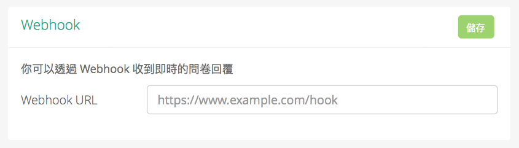
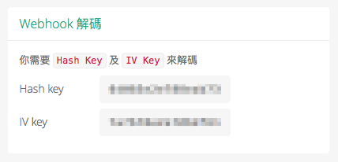

# SurveyCake Webhook

繁中 ｜ [English](https://github.com/SurveyCake/webhook/blob/master/README-en.md)

首先，請在後台設定一個網址來接收我們的通知。

每當問卷有新的填答後，我們會用 POST requrest 夾帶 `url` 參數送至上面所指定的網址。

這個網址的內容是一個加密過後的字串，經過解密後可以拿到這份新的填答結果 JSON。

你必須使用這張圖中的 hash 及 IV 這兩組金鑰來進行解密，我們使用 `AES-128-CBC` (zero-padding) 方式加密，以下是幾種語言的示範：

- [PHP](https://github.com/SurveyCake/webhook/blob/master/decrypt.php)
- [NodeJs](https://github.com/SurveyCake/webhook/blob/master/decrypt.js)
- [Javascript](https://github.com/SurveyCake/webhook/blob/master/decrypt.html)
- [Swift](https://github.com/SurveyCake/webhook/blob/master/Decrypt.swift)
- [Java](https://github.com/SurveyCake/webhook/blob/master/Decrypt.java)

解密完成後，剩下的就交給你囉 :kissing_closed_eyes:

### 填答結果 JSON

~~~javascript
{
	"svid": "SURVEY_ID",
	"title": "survey title",
	"submitTime": "2016-12-25 00:00:00",
	"result": [
		// ....
	]
}
~~~

`result` 是以陣列型態包含著所有的問題及答案，如下：

~~~javascript
"result": [
	{
		"subject": "Do you like SurveyCake",
		"type": "TXTSHORT",
		"answer": [
			"Of course."
		]
	},
	{
		"subject": "Any suggestion ?",
		"type": "TXTSHORT",
		"answer": [
		]
	}
]
~~~
