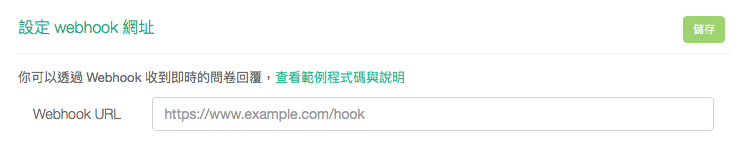
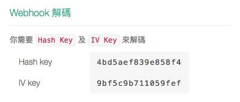

# SurveyCake Webhook

[繁中](./README.md) | [English](./README-en.md)

- [簡介](#簡介)
- [流程](#流程)
- [測試工具](#測試工具)
- [Q & A](#q--a)

## 簡介

透過 SurveyCake Webhook，你可以自行開發 API 去依據問卷蒐集到的答案進行個別的行為觸發。本文件將介紹 SurveyCake Webhook 串接流程及答案解密方法。  
  
SurveyCake Webhook 採用 FIFO（先進先出）方式進行發送。在高流量填答的情況下，可能會導致傳送延遲，影響即時性。但請放心，這不會影響資料的正確性或穩定性。
若你的應用場景對於即時性有較高需求，建議事先評估使用情境，或與我們聯繫，我們將協助你找到最合適的解決方案。

## 流程

- [**Step 1. 設定網址**](#step-1-設定網址)
- [**Step 2. 訪問 API**](#step-2-訪問-api)
- [**Step 3. 查詢答案**](#step-3-查詢答案)
- [**Step 4. 解密答案**](#step-4-解密答案)
- [**Step 5. 運用資料**](#step-5-運用資料)

---

### Step 1. 設定網址

SurveyCake 提供兩種網址設定，讓你可以針對填答的內容做額外的行為觸發；一為 `系統通知 > Webhook`，另一為 `自訂感謝頁`：

- `系統通知 > Webhook`
	- 使用者填答後，SurveyCake 將使用 **POST** request，訪問你所設定的 Webhook URL。
	- 適用於後端 API
- `自訂感謝頁`
	- 使用者填答後，SurveyCake 將使用 **GET** request 將所需參數帶入，並且跳轉至自訂感謝頁。
	- 適用於前端 Script

以下步驟將以 `Webhook URL` 做介紹，若想使用自訂感謝頁，可以直接前往 [測試工具](#測試工具) 段落。

首先，請在後台設定一個 `Webhook URL` 來接收我們的通知。

---

### Step 2. 訪問 API

- 每當問卷有新的填答後，我們會使用 POST requrest 夾帶 `svid` & `hash` 參數送至你所設定的 Webhook URL 網址。
- 你必須使用取得的 `svid` & `hash` 組合成 `Webhook Query API`，格式如下：
	- <https://{SURVEYCAKE_DOMAIN}/webhook/{VERSION}/{SVID}/{HASH}>
- 版本號 (VERSION) 目前請使用 `v0`

##### 👉 Webhook Query API 範例 👈

- POST svid: `yPZQe`
- POST hash: `5fd521e89436c471155f39de9c05bf4c`

~~~
https://{SURVEYCAKE_DOMAIN}/webhook/v0/yPZQe/5fd521e89436c471155f39de9c05bf4c
~~~

---

### Step 3. 查詢答案

訪問組合好的 `Webhook Query API` 可以取得該次 `加密填答結果`。

##### 👉 加密填答結果 範例 👈

~~~
C8jl3+0MLRWZAQtvzcbMJfMdE9F/CkH3qeQd93CdWntbFMk+mWOvSSsE65g5U4Sj/26btUWunpV1Gk9uM1Ltyk+RpqFC+Ve2d8uExGFortYHUuZ32NMeJd1h1DqDJpJy/1epiYMXSDFOEyJUIE1X8zamJAi6D0R5IwADXLVw315PW6B7t+IejkKJNrjlL6cgtI8B1PCAh58oMUQydrJd73zRY4f9O4yC5ZNdg4nloVR4qYWyFkFZOOCE6yExtnMzV/gg4e9gnlYAPb31Wlb3Scjl2akaiO8G78OBWa0r5cmN3MmLQ0NcahViUqOdJ+8v+jPwzh1wIflIuho+JyrgoQ==
~~~

---

### Step 4. 解密答案

剛剛取得的 `加密填答結果`，必須透過`Hash key` & `IV key` 進行解密，才可以拿到可閱讀的填答結果 JSON。Hash key 及 IV Key 可以在 SurveyCake 後台找到，截圖如下。

我們使用 `AES-128-CBC` (PKCS#7 padding) 方式加密，所以請務必使用 `AES-128-CBC` (PKCS#7 padding) 進行解密，其他的解密方式，無法解出正確的資訊，以下是幾種語言的解密示範：

- [Javascript](./decrypt/decrypt.html)
	- 範例使用 [crypto-js](https://github.com/brix/crypto-js)
	- 我們也提供 [Javascript ES5 範例](./decrypt/decrypt-es5.html)
- [PHP](./decrypt/decrypt.php)
	- 範例使用 [openssl_decrypt](http://php.net/manual/en/function.openssl-decrypt.php)
- [NodeJs](./decrypt/decrypt.js)
	- 範例使用 [crypto](https://nodejs.org/api/crypto.html)
- [Python](./decrypt/decrypt.py)
	- 範例使用 [PyCryptoDome library](https://github.com/Legrandin/pycryptodome)
- [Swift](./decrypt/Decrypt.swift)
	- 範例使用 `CommonCrypto` library
- [Java](./decrypt/Decrypt.java)
	- 範例使用 [javax.crypto](https://developer.android.com/reference/javax/crypto/package-summary)

##### 👉 解密後答案 範例 👈

~~~json
{
	"svid": "yPZQe",
	"title": "Webhook Answer Demo",
	"submitTime": "2018-06-28 04:05:47",
	"result": [
		{
			"subject": "What's your name?",
			"type": "TXTSHORT",
			"sn": 0,
			"label": "",
			"alias": "",
			"answer": [
				"SurveyCake Marketing"
			],
			"otherAnswer": [],
			"answerLabel": [],
			"answerAlias": [],
			"extras": null
		},
		{
			"subject": "Gender",
			"type": "CHOICEONE",
			"sn": 1,
			"label": "",
			"alias": "",
			"answer": [
				"Male"
			],
			"otherAnswer": [],
			"answerLabel": [],
			"answerAlias": [],
			"extras": {
				"column": 2,
				"column_m": 1
			}
		},
	]
}
~~~

### Step 5. 運用資料

解密完成後，你可以撰寫 Webhook 邏輯，觸發額外的行為，例如：

- 寫入額外的資料庫
- 寄送 Email
- Webhook 到第三方服務（ex: slack)
- Google Spreadsheet

你可以在 [examples](./examples/) 資料夾找到一些範例。

## 測試工具

SurveyCake 提供一個 Webhook Answer Preview 的測試工具，利用 `自訂感謝頁` 的設定，讓你快速預覽答案的格式。

- Github Repo: https://github.com/SurveyCake/webhook-answer-preview
- Demo: https://surveycake.github.io/webhook-answer-preview/

## Q & A

### 1. 填答結果會是什麼格式？

每份填答結果解密之後會是 JSON 格式，內容包含 `Survey Id`, `Survey Title`, `填答時間` 以及 `填答內容`。

~~~javascript
{
	"svid": "SURVEY ID",
	"title": "SURVEY TITLE",
	"submitTime": "2018-06-28 04:05:47",
	"result": [
		// ....
	]
}
~~~

`result` 會以陣列型態包含所有的問題及答案，內容參考下表：

| Key | 定義 | 備註 |
| -- | -- | -- |
| subject | 題目名稱 | |
| type | 題型 | |
| sn | 題號 | |
| label | 題目標籤 | 適用於設有標籤的題目 |
| alias | 題目別名 | 適用於設有別名的題目 |
| answer | 題目填答 | |
| otherAnswer | 題目其他填答 | 適用於總計題 |
| answerLabel | 題目填答標籤 | 適用於設有標籤的填答 |
| answerAlias | 題目填答別名 | 適用於設有別名的填答 |
| extras | 題目額外資訊 | |

格式範例如下：

~~~javascript
"result": [
    {
      "subject": "引言",
      "type": "QUOTE",
      "sn": 0,
      "label": "",
      "alias": "",
      "answer": [],
      "otherAnswer": [],
      "answerLabel": [],
      "answerAlias": []
    },
    {
      "subject": "分類標題",
      "type": "STATEMENT",
      "sn": 1,
      "label": "",
      "alias": "",
      "answer": [],
      "otherAnswer": [],
      "answerLabel": [],
      "answerAlias": []
    },
    {
      "subject": "分隔線",
      "type": "DIVIDER",
      "sn": 2,
      "label": "",
      "alias": "",
      "answer": [],
      "otherAnswer": [],
      "answerLabel": [],
      "answerAlias": []
    },
    {
      "subject": "單行文字題",
      "type": "TXTSHORT",
      "sn": 3,
      "label": "tag_text_short",
      "alias": "text_short",
      "answer": [
        "單行文字"
      ],
      "otherAnswer": [],
      "answerLabel": [],
      "answerAlias": [],
      "extras": null
    },
    {
      "subject": "多行文字題",
      "type": "TXTLONG",
      "sn": 4,
      "label": "tag_text_long",
      "alias": "text_long",
      "answer": [
        "多行文字\n多行文字\n多行文字"
      ],
      "otherAnswer": [],
      "answerLabel": [],
      "answerAlias": [],
      "extras": null
    },
    {
      "subject": "個資加密題",
      "type": "TXTSHORT",
      "sn": 5,
      "label": "tag_text_short_encrypt",
      "alias": "text_short_encrypt",
      "answer": [
        "加密內容"
      ],
      "otherAnswer": [],
      "answerLabel": [],
      "answerAlias": [],
      "extras": {
        "isPersonal": true
      }
    },
    {
      "subject": "數字題",
      "type": "DIGITINPUT",
      "sn": 6,
      "label": "digit_input",
      "alias": "tag_digit_input",
      "answer": [
        "50"
      ],
      "otherAnswer": [],
      "answerLabel": [],
      "answerAlias": [],
      "extras": null
    },
    {
      "subject": "總計題",
      "type": "CONSTANTSUM",
      "sn": 7,
      "label": "tag_constant_sum",
      "alias": "constant_sum",
      "answer": [
        "總計內容"
      ],
      "otherAnswer": [
        "150"
      ],
      "answerLabel": [
        ""
      ],
      "answerAlias": [
        ""
      ],
      "extras": {
        "showTotal": false,
        "totalLimit": null
      }
    },
    {
      "subject": "單選題",
      "type": "CHOICEONE",
      "sn": 8,
      "label": "tag_choice_one",
      "alias": "choice_one",
      "answer": [
        "選項一"
      ],
      "otherAnswer": [],
      "answerLabel": [
        "tag_option_1"
      ],
      "answerAlias": [
        "option_1"
      ],
      "extras": {
        "column": 2,
        "column_m": 1
      }
    },
    {
      "subject": "複選題",
      "type": "CHOICEMULTI",
      "sn": 9,
      "label": "tag_choice_multi",
      "alias": "choice_multi",
      "answer": [
        "選項一",
        "選項二"
      ],
      "otherAnswer": [],
      "answerLabel": [
        "tag_choice_multi_option_1",
        "tag_choice_multi_option_2"
      ],
      "answerAlias": [
        "choice_multi_option_1",
        "choice_multi_option_2"
      ],
      "extras": {
        "column": 2,
        "column_m": 1
      }
    },
    {
      "subject": "單選矩陣題",
      "type": "NEST",
      "sn": 10,
      "label": "tag_nest",
      "alias": "nest",
      "answer": [],
      "otherAnswer": [],
      "answerLabel": [],
      "answerAlias": []
    },
    {
      "subject": "子題一",
      "type": "NESTCHILD",
      "sn": 11,
      "label": "tag_sub_nest_1",
      "alias": "sub_nest_1",
      "answer": [
        "普通"
      ],
      "otherAnswer": [],
      "answerLabel": [],
      "answerAlias": [],
      "extras": {
        "sbj_opt_pair": null
      }
    },
    {
      "subject": "子題二",
      "type": "NESTCHILD",
      "sn": 13,
      "label": "tag_sub_nest_1",
      "alias": "sub_nest_2",
      "answer": [
        "滿意"
      ],
      "otherAnswer": [],
      "answerLabel": [],
      "answerAlias": [],
      "extras": {
        "sbj_opt_pair": null
      }
    },
    {
      "subject": "複選矩陣題",
      "type": "NEST_MULTI",
      "sn": 14,
      "label": "tag_nest_multi",
      "alias": "nest_multi",
      "answer": [],
      "otherAnswer": [],
      "answerLabel": [],
      "answerAlias": []
    },
    {
      "subject": "子題一",
      "type": "NESTCHILD_MULTI",
      "sn": 15,
      "label": "tag_sub_nest_multi_1",
      "alias": "sub_nest_multi_1",
      "answer": [
        "普通",
        "同意"
      ],
      "otherAnswer": [],
      "answerLabel": [],
      "answerAlias": [],
      "extras": {
        "sbj_opt_pair": null
      }
    },
    {
      "subject": "子題二",
      "type": "NESTCHILD_MULTI",
      "sn": 16,
      "label": "tag_sub_nest_multi_2",
      "alias": "sub_nest_multi_2",
      "answer": [
        "非常同意",
        "同意"
      ],
      "otherAnswer": [],
      "answerLabel": [],
      "answerAlias": [],
      "extras": {
        "sbj_opt_pair": null
      }
    },
    {
      "subject": "重複核選題",
      "type": "PICKFROM",
      "sn": 17,
      "label": "tag_pick_from",
      "alias": "pick_from",
      "answer": [
        "選項一"
      ],
      "otherAnswer": [],
      "answerLabel": [
        "tag_option_1"
      ],
      "answerAlias": [
        "option_1"
      ],
      "extras": {
        "column": 2,
        "column_m": 1,
        "opt_action": "1",
        "unanswered_opts": false
      }
    },
    {
      "subject": "日期題",
      "type": "DATEPICKER",
      "sn": 18,
      "label": "tag_date_picker",
      "alias": "date_picker",
      "answer": [
        "2026-02-09"
      ],
      "otherAnswer": [],
      "answerLabel": [],
      "answerAlias": [],
      "extras": {
        "date_ini": "2026-01-01",
        "date_end": "2026-12-31"
      }
    },
    {
      "subject": "巢狀選擇題",
      "type": "NESTED_DROPDOWN",
      "sn": 19,
      "label": "tag_nest_dropdown",
      "alias": "nest_dropdown",
      "answer": [
        "ASTON MARTIN,DB11 5.2 V12,DB11,2018,汽油"
      ],
      "otherAnswer": [],
      "answerLabel": [],
      "answerAlias": [],
      "extras": {
        "use_general_source": false
      }
    },
    {
      "subject": "項目排序題",
      "type": "ITEMSORT",
      "sn": 20,
      "label": "tag_item_sort",
      "alias": "item_sort",
      "answer": [
        "選項三",
        "選項二",
        "選項一"
      ],
      "otherAnswer": [],
      "answerLabel": [
        "tag_item_sort_option_3",
        "tag_item_sort_option_2",
        "tag_item_sort_option_1"
      ],
      "answerAlias": [
        "item_sort_option_3",
        "item_sort_option_2",
        "item_sort_option_1"
      ],
      "extras": null
    },
    {
      "subject": "數字滑桿題",
      "type": "DIGITSLIDE",
      "sn": 21,
      "label": "tag_digit_slide",
      "alias": "digit_slide",
      "answer": [
        "70"
      ],
      "otherAnswer": [],
      "answerLabel": [],
      "answerAlias": [],
      "extras": null
    },
    {
      "subject": "星級評分",
      "type": "RATINGBAR",
      "sn": 22,
      "label": "tag_rating_bar",
      "alias": "rating_bar",
      "answer": [
        "3"
      ],
      "otherAnswer": [],
      "answerLabel": [],
      "answerAlias": [],
      "extras": {
        "shape": "STAR"
      }
    },
    {
      "subject": "NPS 淨推薦值題",
      "type": "NPS",
      "sn": 23,
      "label": "tag_nps",
      "alias": "nps",
      "answer": [
        "8"
      ],
      "otherAnswer": [],
      "answerLabel": [],
      "answerAlias": [],
      "extras": {
        "leftTxt": "完全不可能",
        "rightTxt": "非常有可能",
        "isColorEnabled": false
      }
    },
    {
      "subject": "檔案上傳題",
      "type": "FILEUPLOAD",
      "sn": 24,
      "label": "tag_file_upload",
      "alias": "file_upload",
      "answer": [
        "example.csv",
        "https://drive.google.com/uc?id=xxxxx&export=download"
      ],
      "otherAnswer": [],
      "answerLabel": [],
      "answerAlias": [],
      "extras": {
        "file_type": [
          "spreadsheet"
        ]
      }
    },
    {
      "subject": "進階選擇題",
      "type": "ADVANCED_SELECTION_BASED",
      "sn": 25,
      "label": "",
      "alias": "",
      "answer": [
        "選項一",
        "其他選項一",
        "其他選項二"
      ],
      "otherAnswer": [],
      "answerLabel": [
        "tag_advanced_selection_option_1",
        "tag_advanced_selection_other_option_1",
        "tag_advanced_selection_other_option_2"
      ],
      "answerAlias": [
        "advanced_selection_option_1",
        "advanced_selection_other_option_1",
        "advanced_selection_other_option_2"
      ],
      "extras": {
        "column": 2,
        "column_m": 1,
        "opt_action": "1",
        "unanswered_opts": false,
        "advanced_selection_sbj_ref": [
          8
        ],
        "advanced_selection_showing_source_image": false
      }
    }
  ]
~~~

以下為 Subject Type 對照表：

#### 選擇題
| Type | 題型名稱 |
| -- | -- |
| CHOICEONE | 單選題 |
| CHOICEMULTI | 複選題 |
| NEST | 單選矩陣題 |
| NESTCHILD | 單選矩陣題子題 |
| NEST_MULTI | 複選矩陣題 |
| NESTCHILD_MULTI | 複選矩陣題子題 |
| PICKFROM | 重複核選題 |
| DATEPICKER | 日期 |
| NESTED_DROPDOWN | 巢狀選擇題 |

#### 輸入題
| Type | 題型名稱 |
| -- | -- |
| TXTSHORT | 單行文字 |
| TXTLONG | 多行文字 |
| DIGITINPUT | 數字 |
| CONSTANTSUM | 總計 |

#### 評分題
| Type | 題型名稱 |
| -- | -- |
| ITEMSORT | 項目排序 |
| DIGITSLIDE | 數字滑桿 |
| RATINGBAR | 星級評分 |
| NPS | NPS 淨推薦值 |

#### 內容與樣式
| Type | 題型名稱 |
| -- | -- |
| QUOTE | 引言 |
| STATEMENT | 分類標題 |
| DIVIDER | 分隔線/分頁 |

#### 上傳題
| Type | 題型名稱 |
| -- | -- |
| FILEUPLOAD | 檔案上傳 |

#### 企業版獨有題型
| Type | 題型名稱 |
| -- | -- |
| ADVANCED_SELECTION_BASED | 進階選擇題 |

### 2. 問卷如果編輯後，Webhook URL 是否也要跟著修改呢？

我們建議你在撰寫 Webhook URL 時，不要使用 answer 陣列順序撰寫 Webhook 邏輯，應該使用 sn 作為比對的依據較佳。

因為問卷修改了題目標題、題目順序後，answer 陣列的順序會變動，此時你可能就會需要調整 Webhook 邏輯，而 sn 為每個題目的在問卷內的不重複編號，所以無論題目怎麼編輯順序，同一個題目 sn 不會變動。

### 3. 刪除的題目還會出現在填答結果內嗎？

不會，刪除的題目，就不會出現在填答結果內了，所以撰寫邏輯時，建議先判斷資料是否存在後再使用。
