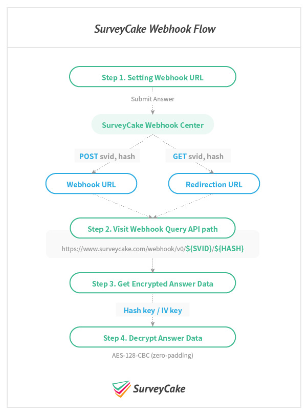

# SurveyCake Webhook

繁中 | [English](https://github.com/SurveyCake/webhook/blob/master/README-en.md)

- [簡介](#簡介)
- [流程](#流程)
- [Q & A](#Q-&-A)

## 簡介

透過 SurveyCake Webhook，你可以自行開發 API 去依據問卷蒐集到的答案進行個別的行為觸發。本文件將介紹 SurveyCake Webhook 串接流程及答案解密方法。

## 流程

- **Step 1. 設定網址**
- **Step 2. 訪問 API**
- **Step 3. 查詢答案**
- **Step 4. 解密答案**
- **Step 5. 運用資料**

### Step 1. 設定網址

SurveyCake 提供兩種網址設定，讓你可以針對填答的內容做額外的行為觸發；一為 `系統通知 > Webhook`，另一為 `自訂感謝頁`：

- `系統通知 > Webhook`
	- 使用者填答後，SurveyCake 將使用 **POST** request，訪問你所設定的 Webhook URL。
	- 適用於後端 API
- `自訂感謝頁`
	- 使用者填答後，SurveyCake 將使用 **GET** request 將所需參數帶入，並且跳轉至自訂感謝頁。
	- 適用於前端 Script

以下步驟將以 `Webhook URL` 做介紹，首先，請在後台設定一個 `Webhook URL` 來接收我們的通知。

### Step 2. 訪問 API

每當問卷有新的填答後，我們會使用 POST requrest 夾帶 `svid` & `hash` 參數送至你所設定的 Webhook URL 網址。

你必須使用取得的 `svid` & `hash` 組合成 `Webhook Query API`，格式如下：

<https://www.surveycake.com/webhook/{VERSION}/{SVID}/{HASH}>

> 版本號 (VERSION) 目前請使用 `v0`

### Step 3. 查詢答案

訪問組合好的 `Webhook Query API` 可以取得該次填答的加密後結果。

### Step 4. 解密答案

剛剛取得的填答結果為加密後的內容，必須透過`Hash key` & `IV key` 進行解密，才可以拿到可閱讀的填答結果 JSON。Hash key 及 IV Key 可以在 SurveyCake 後台找到，截圖如下。

我們使用 `AES-128-CBC` (zero-padding) 方式加密，所以請務必使用 `AES-128-CBC` (zero-padding) 進行解密，其他的解密方式，無法解出正確的資訊，以下是幾種語言的解密示範：

- [Javascript](https://github.com/SurveyCake/webhook/blob/master/decrypt.html)
- [Javascript ES5](https://github.com/SurveyCake/webhook/blob/master/decrypt-es5.html)
- [PHP](https://github.com/SurveyCake/webhook/blob/master/decrypt.php)
- [NodeJs](https://github.com/SurveyCake/webhook/blob/master/decrypt.js)
- [Swift](https://github.com/SurveyCake/webhook/blob/master/Decrypt.swift)
- [Java](https://github.com/SurveyCake/webhook/blob/master/Decrypt.java)

### Step 5. 運用資料

解密完成後，剩下的就交給你囉 :kissing_closed_eyes:

## Q & A

### 1. 填答結果會是什麼格式？

每份填答結果解密之後會是 JSON 格式，內容包含 `Survey Id`, `Survey Title`, `填答時間` 以及 `填答內容`。

~~~javascript
{
	"svid": "SURVEY ID",
	"title": "SURVEY TITLE",
	"submitTime": "2016-12-25 00:00:00",
	"result": [
		// ....
	]
}
~~~

`result` 是以陣列型態包含著所有的問題及答案，我們提供 `Subject Title`, `Subject Type`, `Answer`，格式範例如下：

~~~javascript
"result": [
	{
		"subject": "Do you like SurveyCake",
		"type": "TXTSHORT",
		"answer": [
			"Of course."
		]
	},
	{
		"subject": "Any suggestion ?",
		"type": "TXTSHORT",
		"answer": [
		]
	}
]
~~~

